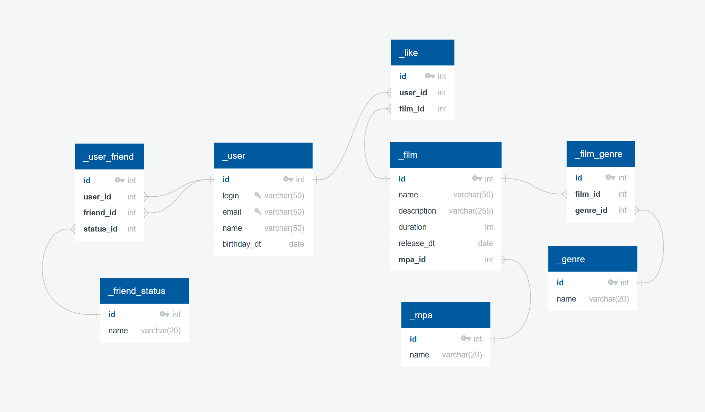

# Схема данных проекта java-filmorate 

## User
id PK int \
email varchar(50) UNIQUE \
login varchar(50) UNIQUE \
name varchar(50) \
birthday_dt date 

## UserFriend
id PK int \
user_id int FK >- User.id \
friend_id int FK >- User.id \
status_id int FK >- FriendshipStatus.id

## FriendshipStatus 
id PK int \
name varchar(20)

## Film
id PK int \
rating_id int FK >- Rating.id \
name varchar(50) \
description varchar(255) \
release_dt date

## FilmUserLike
id PK int \
user_id int FK >- User.id \
film_id int FK >- Film.id

## Rating
id PK int \
name varchar(20)

## FilmGenre
id PK int \
film_id int FK >- Film.id \
genre_id int FK >- Genre.id

## Genre
id PK int \
name varchar(20)
